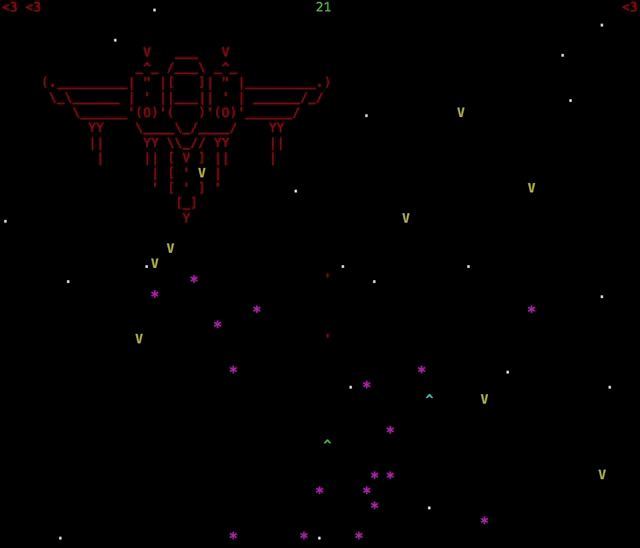

# Piscine CPP
The C++ baptism, 42 style

```c++
int	main(int ac, char **av)
{
	std::cout << "Hello World!" << std::endl
	return (0);
}
```

# Installing

```
$> git clone https://github.com/grumbach/Piscine_CPP
```

# Multiplayer Terminal Space Invader

Coded in 48h using [ncurses](https://www.gnu.org/software/ncurses/) with [@phaninho](https://github.com/phaninho).



# Git Clone の術

``` subjects/clone/GitCloneNoJustu ```
removes all file Headers.

*You are a terrible person...*

```
$> GitCloneNoJustu  `ls */*`
```
